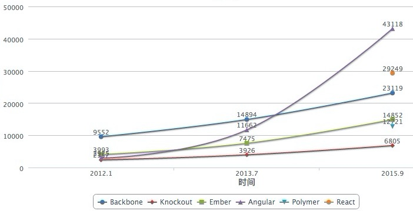
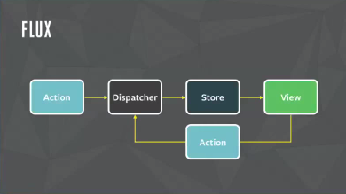
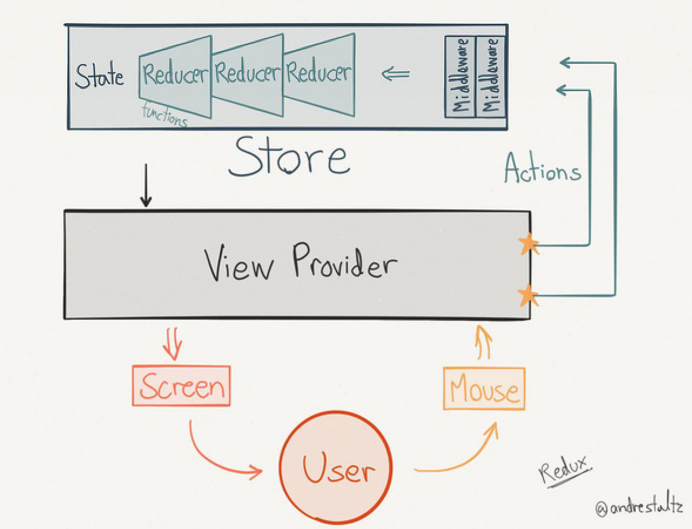
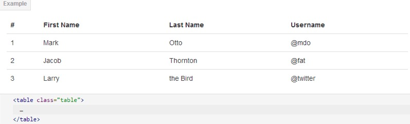
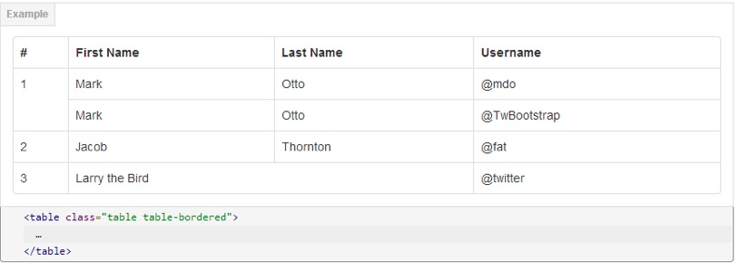
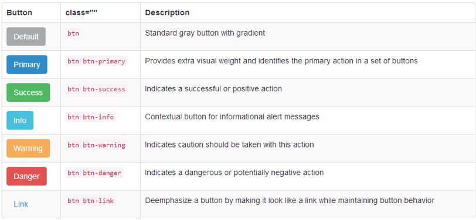

# 前端技术分享
By Zack Yang @ DOP


- ### 发展趋势 <!-- .element: class="fragment highlight-blue" -->
- ### 技术选型
- ### 组件介绍
- ### 演示


- Web 设计趋势
  - No Flash
  - Metro / Flat / Material
  - SPA
  - Responsive


- JavaScript 技术趋势
  - Web components
  - ECMAScript 6
  - Babel
  - NodeJS 4.0
  - Isomorphism


- ### 发展趋势
- ### 技术选型 <!-- .element: class="fragment highlight-blue" -->
- ### 组件介绍
- ### 演示


#### 技术选型
  - JS Framework <!-- .element: class="fragment highlight-blue" -->
  - CSS Framework
  - JS 替代品
  - CSS 替代品


- Why JS Framework
  - 如果什么框架也没用, 要么不是在做应用, 要么 out 了
  - 从某种意义上讲, 无论你选择哪个, 都能得到好处
  - 选择会深刻影响你的架构


- 共识
  - MV*
  - 数据绑定
  - 许可和源代码控制


- 分歧: 库 || 框架
    - 库, 插到既有架构中, 补充特定功能
    - 框架, 只要遵守, 那剩下的就全都是处理通用需求


- 分歧: 灵活 || 整合
    - 灵活, 只有这样才能从总体上确保跟第三方库兼容
    - 整合, 只有内置才能保证无缝整合


- 对比
  - Backbone
  - Knockout
  - AngularJS
  - React





- Backbone
  - MVC
  - \+ 广大社群支持者, 教程完善
  - \+ 没有改变 HTML 写法
  - \- 功能单一


- Knockout
  - MVVM
  - \+ 兼容IE6
  - \+ 事件声明式绑定
  - \- 语法不优雅
  - \- ko.observable(data)


- AngularJS
  - Model View Whatever
  - \+ 复用 directive
  - \+ 简易 routing
  - \- 创造过多的概念 (DI, service, factory, module)
  - \- 脏检查性能问题
  - \- 学习曲线陡峭, 学习成本高


- React
  - View
  - \+ 支持 IE8
  - \+ Virtual DOM
  - \+ No Templates (JSX)
  - \+ react-native
  - \+ 概念少, API 少


#### 技术选型
  - JS Framework
  - CSS Framework <!-- .element: class="fragment highlight-blue" -->
  - JS 替代品
  - CSS 替代品


- Why CSS Framework
  - 兼容性
  - 快速开发
  - 可复用性
  - 结构明晰
  - 可扩展性(主题)


- CSS Framework
  - [Bootstrap](http://getbootstrap.com/)
  - [Foundation](http://foundation.zurb.com/)
  - [Pure](http://purecss.io/)
  - [Normalize](https://necolas.github.io/normalize.css/)
  - [Reset CSS](http://meyerweb.com/eric/tools/css/reset/)


#### 技术选型
  - JS Framework
  - CSS Framework
  - JS 替代品 <!-- .element: class="fragment highlight-blue" -->
  - CSS 替代品


- Dart
  - 自带 IDE
  - 可在 Dart VM 中运行
- TypeScript
  - 完全兼容 JS
  - 静态类型
- CoffeeScript
  - 优雅
  - 抛弃 JS 的毒瘤与糟粕
- ECMAScript 6
  - 原生
  - 新特性


- 技术选型
  - JS Framework
  - CSS Framework
  - JS 替代品
  - CSS 替代品 <!-- .element: class="fragment highlight-blue" -->


- SASS / SCSS
  - 以缩进分割代码块
- LESS
  - 兼容 CSS (只使用感兴趣的部分)


- ### 发展趋势
- ### 技术选型
- ### 组件介绍 <!-- .element: class="fragment highlight-blue" -->
- ### 演示


#### 组件介绍
  - React <!-- .element: class="fragment highlight-blue" -->
  - Redux
  - Bootstrap
  - ECMAScript 6
  - SASS
  - More...


render

```
React.render(
  <h1>Hello, world!</h1>,
  document.getElementById('example')
);
```


JSX

```
var names = ['Alice', 'Emily', 'Kate'];

React.render(
  <div>
  {
    names.map(function (name) {
      return <div>Hello, {name}!</div>
    })
  }
  </div>,
  document.getElementById('example')
);
```


Components

```
var HelloMessage = React.createClass({
  render: function() {
    return <h1>Hello {this.props.name}</h1>;
  }
});

React.render(
  <HelloMessage name="John" />,
  document.getElementById('example')
);
```


this.state

```
var LikeButton = React.createClass({
  getInitialState: function() {
    return {liked: false};
  },
  handleClick: function(event) {
    this.setState({liked: !this.state.liked});
  },
  render: function() {
    var text = this.state.liked ? 'like' : 'haven\'t liked';
    return (
      <p onClick={this.handleClick}>
        You {text} this. Click to toggle.
      </p>
    );
  }
});

React.render(
  <LikeButton />,
  document.getElementById('example')
);
```


- 生命周期
  - 状态
    - Mounting
    - Updating
    - Unmounting
  - 处理函数
    - componentWillMount
    - componentDidMount
    - componentWillUpdate
    - componentDidUpdate
    - componentWillUnmount


- 总结
  - 单向数据流
  - 状态机
  - 不直接操作 DOM


#### 组件介绍
  - React
  - Redux <!-- .element: class="fragment highlight-blue" -->
  - Bootstrap
  - ECMAScript 6
  - SASS
  - More...








Redux = Flux + Reducer


Reducer = (state, action) => state


#### 组件介绍
  - React
  - Redux
  - Bootstrap <!-- .element: class="fragment highlight-blue" -->
  - ECMAScript 6
  - SASS
  - More...


- Bootstrap
  - 跨设备，跨浏览器
  - 响应式设计
  - 12列栅格系统
  - 集成 Normalize.css











- 更多...
  - 下拉菜单
  - 按钮组
  - 按钮下拉菜单
  - 导航
  - 导航条
  - 面包屑
  - 分页
  - 标签与徽章
  - 排版
  - 缩略图
  - 警告框
  - 进度条


#### 组件介绍
  - React
  - Redux
  - Bootstrap
  - ECMAScript 6 <!-- .element: class="fragment highlight-blue" -->
  - SASS
  - More...


Promise

```
var promise = new Promise(function(resolve, reject) {
  // ... some code

  if (/* success */){
    resolve(value);
  } else {
    reject(error);
  }
});
```


let

```
{
  let a = 10;
  var b = 1;
}

a // ReferenceError: a is not defined.
b // 1
```


const

```
const PI = 3.1415;
PI // 3.1415

PI = 3;
PI // 3.1415
```


arrow functions

```
const f = () => 5;

const sum = (num1, num2) => num1 + num2;

const square = n => n * n;

[1,2,3].map(x => x * x);

values.sort((a, b) => a - b);
```


解构函数

```
// 解构数组
var [a, b, c] = [1, 2, 3];

// 解构对象
let { log, sin, cos } = Math;

// 解构函数
function add([x, y]){
  return x + y;
}
add([1, 2])

// 交换变量
[x, y] = [y, x];
```


class

```
class Point {
  constructor(x, y) {
    this.x = x;
    this.y = y;
  }

  toString() {
    return '('+this.x+', '+this.y+')';
  }
}
```


Module

```
// 运行时加载
let { stat, exists, readFile } = require('fs');

// 编译时加载
import { stat, exists, readFile } from 'fs';
```


- 更多...
  - Symbol
  - Set & Map
  - Generator
  - Decorator (ES7)


#### 组件介绍
  - React
  - Redux
  - Bootstrap
  - ECMAScript 6
  - SASS<!-- .element: class="fragment highlight-blue" -->
  - More...


变量

```
$fontStack:    Helvetica, sans-serif;
$primaryColor: #333;

body {
  font-family: $fontStack;
  color: $primaryColor;
}
```


嵌套

```
nav {
  ul {
    margin: 0;
    padding: 0;
    list-style: none;
  }

  li { display: inline-block; }

  a {
    display: block;
    padding: 6px 12px;
    text-decoration: none;
  }
}
```


mixin

```
@mixin box-sizing ($sizing) {
    -webkit-box-sizing:$sizing;     
       -moz-box-sizing:$sizing;
            box-sizing:$sizing;
}
.box-border{
    border:1px solid #ccc;
    @include box-sizing(border-box);
}
```


继承

```
.message {
  border: 1px solid #ccc;
  padding: 10px;
  color: #333;
}

.success {
  @extend .message;
  border-color: green;
}

.error {
  @extend .message;
  border-color: red;
}

.warning {
  @extend .message;
  border-color: yellow;
}
```


运算

```
.container { width: 100%; }

article[role="main"] {
  float: left;
  width: 600px / 960px * 100%;
}

aside[role="complimentary"] {
  float: right;
  width: 300px / 960px * 100%;
}
```


- 更多...
  - 占位选择器
  - 函数
  - 条件判断
  - 循环


#### 组件介绍
  - React
  - Redux
  - Bootstrap
  - ECMAScript 6
  - SASS
  - More... <!-- .element: class="fragment highlight-blue" -->


- More Tools
  - [Font-Awesome](https://fortawesome.github.io/Font-Awesome/)
  - [lodash](https://lodash.com/) / [Underscore](http://underscorejs.org/)
  - [Moment.js](http://momentjs.com/)
  - [Animate.css](https://daneden.github.io/animate.css/)
  - [Modernizr](https://modernizr.com/)


- More Components
  - [Textillate.js](https://jschr.github.io/textillate/)
  - [clipboard.js](http://zenorocha.github.io/clipboard.js/)
  - [Intro.js](http://usablica.github.io/intro.js/)
  - [shepherd](http://github.hubspot.com/shepherd/docs/welcome/)
  - [fullPage](http://alvarotrigo.com/fullPage/)
  - [messenger](http://github.hubspot.com/messenger/docs/welcome/)
  - [Sortable](http://github.hubspot.com/sortable/docs/welcome/)
  - [intl-tel-input](http://jackocnr.com/intl-tel-input.html)
  - [Hover.css](http://ianlunn.github.io/Hover/)
  - [headroom.js](http://wicky.nillia.ms/headroom.js/)
  - [Notification](http://tympanus.net/Development/NotificationStyles/)


- More Fun
  - [parallax](http://matthew.wagerfield.com/parallax/)
  - [TheaterJS](http://codepen.io/Zhouzi/full/JoRazP/)
  - [ifvisible.js](http://serkanyersen.github.io/ifvisible.js/demo.html)
  - [favico.js](http://lab.ejci.net/favico.js/)
  - [snabbt.js](http://daniel-lundin.github.io/snabbt.js/)
  - [countUp](http://inorganik.github.io/countUp.js/)
  - [odometer](http://github.hubspot.com/odometer/)
  - [offline](http://github.hubspot.com/offline/docs/welcome/)
  - [vex](http://github.hubspot.com/vex/docs/welcome/)


- More Resources
  - [JavaScript 秘密花园](http://bonsaiden.github.io/JavaScript-Garden/zh/)
  - [JavaScript Promise 迷你书](http://liubin.github.io/promises-book/)
  - [ECMAScript 6 入门](http://es6.ruanyifeng.com/#README)
  - [ES6 代码风格指南](https://github.com/airbnb/javascript)
  - [前端代码风格指南](https://github.com/bendc/frontend-guidelines)
  - [React 教程](http://reactjs.cn/react/docs/getting-started.html)
  - [Redux 教程](http://camsong.github.io/redux-in-chinese/index.html)
  - [Dan Abramov - Live React](https://www.youtube.com/watch?v=xsSnOQynTHs)


- ### 发展趋势
- ### 技术选型
- ### 介绍
- ### 演示 <!-- .element: class="fragment highlight-blue" -->


- 演示
  - DAAS Admin


##Q & A


##THE END
###By Zack Yang